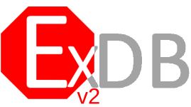

<!--PROJECT HEAD-->
<br />
<p align="center">
  <a href="https://edb.foxgirls.cc">
    
  </a>

  <h3 align="center">Expandable-DJS-Bot</h3>

  <p align="center">
    The easy to use Discord.js v12 bot template
    <br />
    <a href="https://github.com/AngelNull/expandable-djs-bot/releases"><strong>Download »</strong></a>
    <br />
    <br />
    <a href="#contributing">Contributing</a>
    ·
    <a href="https://github.com/AngelNull/expandable-djs-bot/issues">Issues</a>
    ·
    <a href="https://github.com/AngelNull/expandable-djs-bot/pulls">Pull Requests</a>
  </p>
</p>

<p align="center">
<!--Contributors-->

<!--Forks-->

<!--Stars-->

<!--Issues-->

</p>

# 

<!-- TABLE OF CONTENTS -->
<details open="open">
  <summary>Table of Contents</summary>
  <ol>
    <li>
      <a href="#purpose">Purpose</a>
    </li>
    <li>
      <a href="#setup">Setup</a>
    </li>
    <li><a href="#documentation">Documentation</a></li>
    <li><a href="#contributing">Contributing</a></li>
    <li><a href="#versioning">Versioning</a></li>
  </ol>
</details>

## Purpose
Expandable-DJS-Bot (EDB) is a discord.js bot template, allowing for easy expansion with new commands, translations and more. 

This template has been created from the ground up based on multiple discord bots made in the past, and provides an easy to understand and maintain environment.

## Setup
A full version of the setup guide can be found [here](https://edb.foxgirls.cc/docs/installation/setup)

Quick Setup Version
```
1. Clone/Download Project
2. Run npm install
3. Run npm run config 
4. Run node .
````

## Documentation
The documentation for this project can be found on the [website](https://edb.foxgirls.cc/docs) or in the documentation branch, if you plan to make any changes please target your pull requests there.

## Contributing
First of all, thank you for thinking about contributing! Everything you need to know to contribute can be found [here](./.github/CONTRIBUTING.md)

## Version
This project uses CI to release changelogs and new versions, you can learn more about this by checking [here](./.github/VERSIONING.MD).
